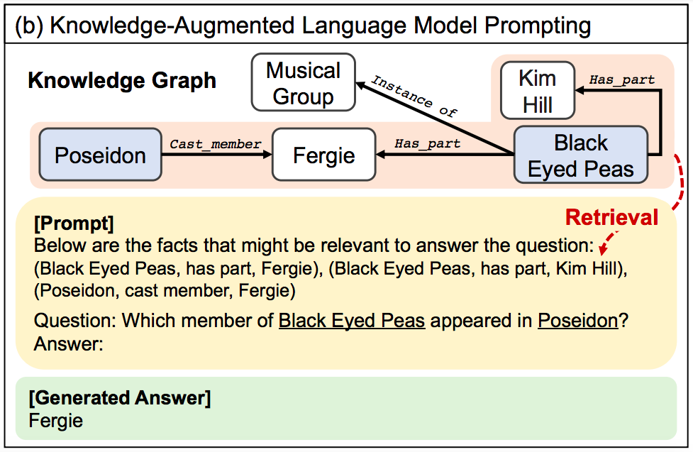

# KAPING

This contains script that reimplements KAPING framework (Knowledge-Augmented Language Model Prompting for Zero-Shot Knowledge Graph Question Answering, Baek et al. 2023 [URL](https://arxiv.org/abs/2306.04136))

The process for KAPING will work as follows:


### Requirements
* at least python3.8 (tested on python3.8, python3.10, python 3.11)

* After cloning the repository, install the requirements
```sh
$ pip install -r requirements.txt
```

### Structure
```bash 
.
├── README.md
├── arguments.py
├── kaping
│   ├── entity_extractor.py
│   ├── entity_injection.py
│   ├── entity_verbalization.py
│   └── model.py
├── qa
│   ├── qa_evaluate.py
│   ├── qa_inference.py
│   └── qa_preprocessing.py
├── requirements.txt
└── run.py 
```

### Simple run

* With default, this script will run a QA-inference model using Bert-large-uncased with KAPING (retrieved top-10-triples) to create prompt on CPU
```sh
$ python run.py --input <mintaka_dataset.json> 
```
* To check all arguments
```
$ python run.py -h
```


* Pipeline are designed to treat Question and Context together as a Prompt and fed into the pipeline to request model to generate answer, not find the answer from the given inputs. Thus the inference task used are *text2text-generation* or *text-generation* depending on which model is compatible.

* Available to test is `gpt2`, `t5-small`, `t5-base`, `t5-large`, but if you have sufficient space resource, you can try larger `t5`. Also, if you want to try other models, please check back on https://huggingface.co/. 
