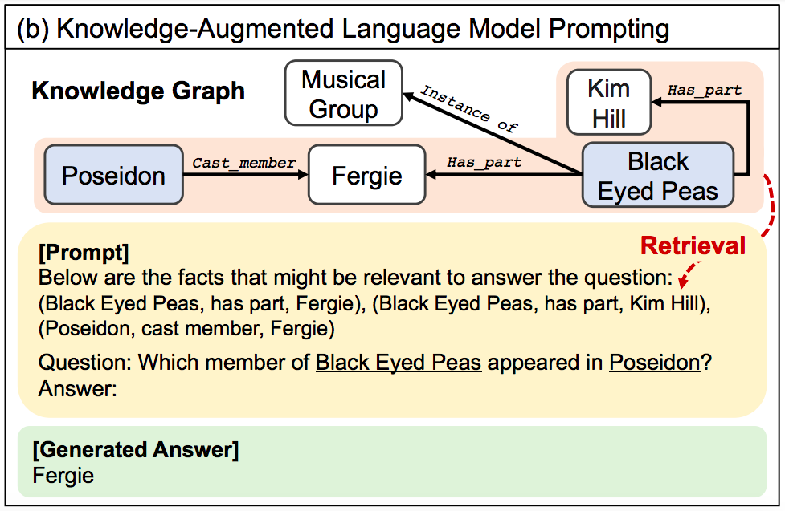

# KAPING

Reimplementation of the **KAPING** framework (Knowledge-Augmented Language Model Prompting for Zero-Shot Knowledge Graph Question Answering, Baek et al. 2023 — [paper](https://arxiv.org/abs/2306.04136)).

The process for KAPING will work as follows:


Developed as part of the **Computational Linguistics** programme at Heidelberg University, Summer 2023.

---

## Architecture

```
Question
   |
   v
ReFInED (entity linking)  -->  entity set
   |
   v
REBEL (relation extraction from Wikipedia)  -->  knowledge triples (KGs)
   |
   v
MPNet (all-mpnet-base-v2)  -->  cosine similarity  -->  top-k triples
   |
   v
Prompt = leading text + top-k triples + question  -->  QA model (T5 / GPT-2 / BERT)
   |
   v
Predicted answer
```

---

## Project Structure

```
.
├── .github/workflows/ci.yml   # Lint (ruff) + unit/e2e tests
├── .pre-commit-config.yaml
├── Dockerfile
├── arguments.py               # CLI argument parser
├── kaping/
│   ├── entity_extractor.py    # ReFInED entity linking
│   ├── entity_verbalization.py# REBEL relation extraction + Wikipedia scraping
│   ├── entity_injection.py    # MPNet similarity + prompt construction
│   └── model.py               # Top-level KAPING pipeline
├── qa/
│   ├── qa_inference.py        # HuggingFace pipeline inference
│   ├── qa_evaluate.py         # Accuracy calculation
│   └── qa_preprocessing.py   # Mintaka dataset loader
├── tests/
│   ├── unit/                  # Fast tests (stubbed ML deps)
│   └── e2e/                   # Integration tests
├── pyproject.toml             # Poetry dependencies (Python 3.11+)
└── run.py                     # Main entry point
```

---

## Requirements

- Python 3.11 or 3.12
- [Poetry](https://python-poetry.org/docs/#installation) **or** Docker

---

## Setup & Running

### Option A — Poetry (local)

```sh
# Install dependencies
poetry install

# Run KAPING with default settings (BERT-large-uncased, top-10 triples, CPU)
poetry run python run.py --input <mintaka_dataset.json>

# Show all arguments
poetry run python run.py -h
```

### Option B — Docker

```sh
docker build -t kaping .
docker run --rm kaping python run.py --input <mintaka_dataset.json>
```

---

## CLI Arguments

| Argument | Default | Description |
|----------|---------|-------------|
| `--input` | *(required)* | Path to Mintaka dataset JSON file |
| `--output` | auto-generated | Output CSV file path |
| `--k` | 10 | Number of triples to retrieve |
| `--random` | false | Use random knowledge baseline instead of KAPING |
| `--no_knowledge` | false | Use no knowledge (prompt-only baseline) |
| `--inference_task` | `text2text-generation` | `text2text-generation` or `text-generation` |
| `--model_name` | `bert-large-uncased` | Model to use for QA inference |
| `--device` | -1 (CPU) | Device index (0+ for GPU) |

Supported models:
- `text2text-generation`: `bert-large-uncased`, `t5-small`, `t5-base`, `t5-large`
- `text-generation`: `gpt2`

> **Note:** The pipeline treats Question and Context together as a single Prompt fed into the model to *generate* an answer, not to extract it from the input. The inference task (`text2text-generation` or `text-generation`) must match the model architecture.

> Available models to test: `gpt2`, `t5-small`, `t5-base`, `t5-large`. If you have sufficient resources, you can try larger `t5` variants or other models from [HuggingFace](https://huggingface.co/).

---

## Development

```sh
poetry install --with dev

# Lint
pre-commit run --all-files

# Tests (unit + e2e, no real ML models needed)
poetry run pytest -m "not system and not slow" -v

# All tests (requires network + model downloads)
poetry run pytest -v
```

---

## CI

| Workflow | Trigger | Steps |
|----------|---------|-------|
| `ci.yml` | Push / PR to `main` | ruff lint + pytest (unit & e2e) |
